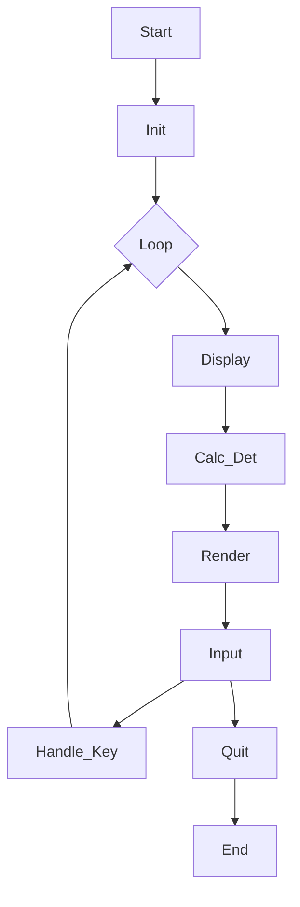

# Interactive Matrix Determinant

This project is an interactive tool for calculating matrix determinants, utilizing the `termui-cpp` library.

**Credit:**
*   `termui-cpp`: [https://github.com/claby2/termui-cpp](https://github.com/claby2/termui-cpp)

**Kelas Aljabar Linier C31020101 Kelompok 9:**
*   Zain Akbar Rizkia (202531091)
*   Iqbal Raihan Raffianza (202531111)
*   FX. Oktabimo DwiPriabudi Sumintro (202531085)
*   Lewis Radhi Oktasamiqdad (202531107)

## Program Flow

