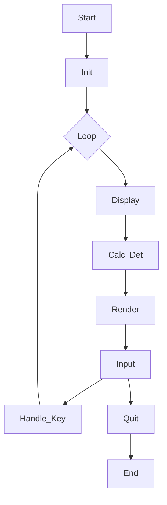
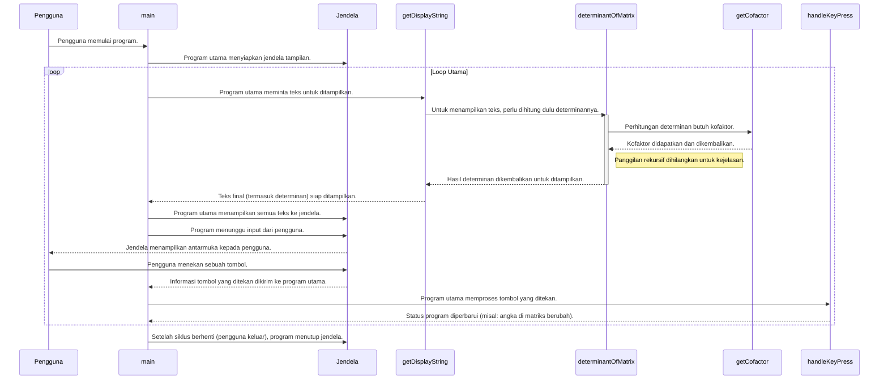
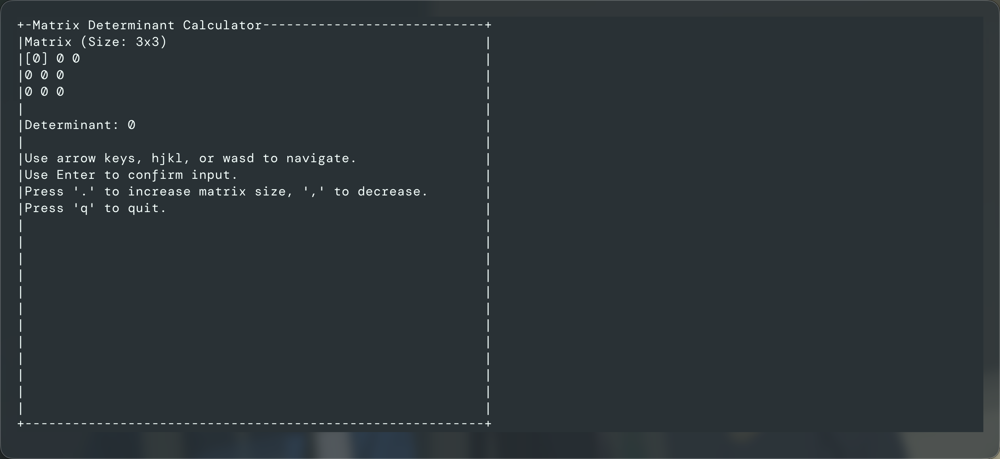

# Interactive Matrix Determinant

This project is an interactive tool for calculating matrix determinants, utilizing the `termui-cpp` library.

**Credit:**
*   `termui-cpp`: [https://github.com/claby2/termui-cpp](https://github.com/claby2/termui-cpp)

**Kelas Aljabar Linier C31020101 Kelompok 9:**
*   Zain Akbar Rizkia (202531091)
*   Iqbal Raihan Raffianza (202531111)
*   FX. Oktabimo DwiPriabudi Sumintro (202531085)
*   Lewis Radhi Oktasamiqdad (202531107)

<details>
<summary>Prerequisites (Click to expand)</summary>

To build and run this project, you will need:

*   **C++ Compiler**: A C++17 compatible compiler (e.g., GCC, Clang, MSVC).
    *   **Windows**: MinGW-w64 (Minimalist GNU for Windows) is recommended.
    *   **macOS/Linux**: GCC or Clang are typically pre-installed or easily installable via package managers.
*   **CMake**: A cross-platform open-source build system.

### Installation

**C++ Compiler:**

*   **Windows (MinGW-w64):**
    ```bash
    winget install MinGW-w64
    # Or download from https://mingw-w64.org/doku.php/download
    ```
*   **macOS (GCC/Clang):**
    ```bash
    xcode-select --install # Installs Xcode Command Line Tools including Clang
    # Or for GCC: brew install gcc
    ```
*   **Linux (GCC/Clang):**
    ```bash
    sudo apt update && sudo apt install build-essential # For Debian/Ubuntu
    # Or equivalent for your distribution
    ```

**CMake:**

*   **macOS (using Homebrew):**
    ```bash
    brew install cmake
    ```
*   **Windows (using Winget):**
    ```bash
    winget install CMake
    ```
*   **Linux:**
    ```bash
    sudo apt install cmake # For Debian/Ubuntu
    # Or equivalent for your distribution
    ```

</details>

<details>
<summary>Build Instructions (Click to expand)</summary>

To build the project, navigate to the project root directory and execute the following commands:

```bash
cmake -B build
cmake --build build
```

To run the executable:

```bash
./build/0001
```

</details>

## Program Flow



## Sequence Diagram



## Screenshot


